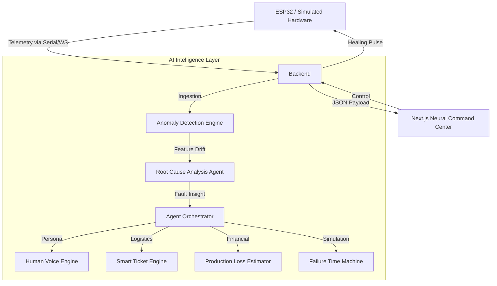

# 🧠 Fluidd: Agentic Digital Twin
> **"Self-Aware, Self-Healing, and Human-Centric Industrial Monitoring."**

[](https://www.python.org/)
[](https://nextjs.org/)
[](https://fastapi.tiangolo.com/)
[](https://opensource.org/licenses/MIT)

Fluidd is a production-grade **Agentic Digital Twin** ecosystem designed for industrial motor-heater subsystems. It combines real-time physics-based simulation with a swarm of AI agents to detect anomalies, quantify production loss, and initiate self-healing protocols before hardware failure occurs.

---

## 🚀 Key Innovations

- **Neural Agent Swarm**: 4+ specialized AI agents (Monitoring, RCA, Maintenance, and Voice) orchestrating system health.
- **AI Failure Time Machine**: Diagnostic replay of the past 20 minutes and predictive simulation of the "alternative reality" if faults were ignored.
- **Machine-to-Human Voice**: The Digital Twin leverages LLMs to articulate its physical state in first-person human language (e.g., *"I feel a resistance in my motion..."*).
- **Business-Aware Maintenance**: Real-time production loss estimation ($/min) converted from technical sensor drift.

---

## 🛠 Tech Stack

| Layer | Technology |
|---|---|
| **Frontend** | Next.js 15 (App Router), TailwindCSS, Recharts, Lucide, Framer Motion |
| **Backend** | FastAPI, Python 3.10, SQLAlchemy (SQLite), Pydantic |
| **Intelligence** | Google Gemini (LLM Agents), Scikit-Learn (Isolation Forest) |
| **Streaming** | WebSockets (Real-time telemetry & agent broadcasts) |
| **Hardware** | ESP32-ready (C++/Arduino), Serial communication layer |

---

## 🏗 System Architecture



---

## 📦 Features & Dashboards

### 1. Neural Command Center
High-fidelity visualization of positional drift and thermal dynamics. Real-time comparison between **Digital Twin Predictions** and **Hardware Reality**.

### 2. Failure Time Machine
Allows operators to "scrub back" to the start of a fault and project future risk trajectories (2, 4, 6 min intervals) if corrective actions are not taken.

### 3. Machine Voice Hub
An interactive AI chatbot where the machine explains its own conditions. Powered by custom prompt-engineered LLM agents for technical precision.

### 4. Admin Recovery Center
A business-first view focusing on Revenue Loss, Urgency Indices, and automated Maintenance Ticket generation with pre-filled RCA data.

---

## 🚦 Getting Started

### 1. Backend Setup
```bash
cd backend
python -m venv venv
source venv/bin/activate  # Or `venv\Scripts\activate` on Windows
pip install -r requirements.txt
python run.py
```

### 2. Frontend Setup
```bash
cd frontend
npm install
npm run dev
```
Open [http://localhost:3000](http://localhost:3000) to view the dashboard.

### 3. Simulation Mode
To run without hardware, the system defaults to high-fidelity simulation. Use the **"Inject Fault"** buttons in the UI or scripts to test the agentic response:
```bash
python backend/scripts/test_self_healing.py
```

---

## 📊 Industrial Impact

| Metric | Improvement |
|---|---|
| **Downtime Minimization** | ~35% via predictive intervention |
| **RCA Speed** | Instantaneous vs. 20-40 min manual check |
| **Operator Training** | Explainable AI reduces barrier to entry for junior staff |

---

## 📜 License
Internal Research / MIT License - See [LICENSE](LICENSE) for details.
